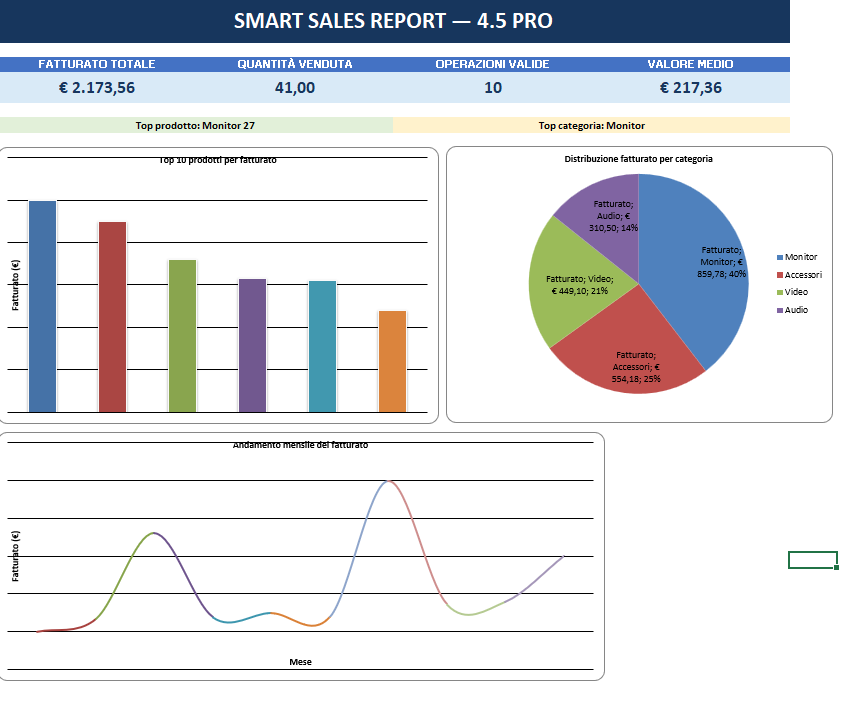

# Smart Sales Report — V4.5 PRO

Smart Sales Report è un'applicazione Python per l'automazione dell'analisi dei dati di vendita e la generazione di report Excel professionali.

Il programma importa dati commerciali da file CSV o Excel, esegue automaticamente operazioni di pulizia e validazione, riconosce le principali colonne di vendita, calcola KPI aziendali e genera un report Excel completo con dashboard, grafici, analisi temporali e controlli sulla qualità dei dati.

L'obiettivo del progetto è trasformare rapidamente dati di vendita grezzi in informazioni chiare e utilizzabili per il processo decisionale.

---
## 📊 Dashboard



## Funzionalità principali

### Importazione e preparazione dati

- Importazione di file CSV
- Importazione di file Excel XLSX e XLSM
- Rilevamento automatico della codifica dei CSV
- Pulizia automatica dei dati
- Eliminazione delle righe e colonne completamente vuote
- Rimozione dei record duplicati
- Normalizzazione delle intestazioni
- Gestione dei valori mancanti
- Riconoscimento automatico delle principali colonne commerciali

### Gestione intelligente dei valori numerici

Smart Sales Report gestisce diversi formati numerici comunemente presenti nei file aziendali, inclusi:

- formati europei
- formati internazionali
- separatori decimali
- separatori delle migliaia
- simboli di valuta
- valori negativi

Questo permette di elaborare file provenienti da fonti differenti riducendo la necessità di correzioni manuali.

### Analisi delle vendite

Il programma può analizzare automaticamente:

- fatturato
- quantità vendute
- numero di operazioni
- valore medio delle operazioni
- performance dei prodotti
- performance delle categorie
- performance dei clienti
- andamento temporale delle vendite

### Controllo qualità

Il sistema identifica e segnala dati potenzialmente problematici, tra cui:

- quantità non valide
- prezzi non validi
- valori mancanti
- quantità negative
- prezzi negativi
- date mancanti o non riconosciute

Le righe problematiche possono essere riportate separatamente nel foglio `Anomalie`.

---

## KPI

Quando le colonne necessarie sono disponibili, Smart Sales Report calcola automaticamente KPI come:

- Fatturato totale
- Quantità totale venduta
- Numero di operazioni valide
- Valore medio per operazione
- Prodotto con il maggior fatturato
- Categoria con il maggior fatturato
- Numero di clienti unici
- Prima vendita rilevata
- Ultima vendita rilevata
- Variazione percentuale dell'ultimo mese disponibile

I KPI vengono calcolati utilizzando le righe considerate valide per l'analisi.

---

## Dashboard Excel

Il report genera automaticamente una dashboard progettata per offrire una panoramica immediata delle performance commerciali.

La dashboard può includere:

- KPI principali
- Top prodotto
- Top categoria
- Top prodotti per fatturato
- Distribuzione del fatturato per categoria
- Andamento mensile del fatturato

I grafici vengono generati direttamente nel file Excel tramite OpenPyXL.

---

## Report generato

A seconda delle informazioni disponibili nel dataset, il report Excel può contenere i seguenti fogli:

- `Dashboard`
- `Dati Puliti`
- `Statistiche`
- `Qualita Dati`
- `Informazioni`
- `Vendite per Prodotto`
- `Vendite per Categoria`
- `Vendite per Cliente`
- `Andamento Mensile`
- `Anomalie`

Alcuni fogli vengono creati solamente quando nel file sorgente sono presenti le colonne necessarie.

---

## Riconoscimento automatico delle colonne

Il programma cerca di identificare automaticamente colonne equivalenti anche quando utilizzano denominazioni differenti.

Ad esempio, può riconoscere varianti relative a:

- quantità
- prezzo
- prodotto
- categoria
- data
- cliente

Questo rende l'applicazione più flessibile nell'elaborazione di file provenienti da aziende o sistemi differenti.

---

## Logging e gestione degli errori

Smart Sales Report include un sistema di logging che registra informazioni utili sull'esecuzione del programma.

Il file locale:

`smart_sales_report.log`

può essere utilizzato per diagnosticare eventuali problemi durante l'elaborazione.

Il log è escluso dal repository Git tramite `.gitignore`.

Sono inoltre gestiti errori comuni come:

- file vuoti
- formati non supportati
- problemi di lettura
- impossibilità di scrivere il report
- file Excel già aperti
- errori durante l'elaborazione

---

## Tecnologie

Il progetto utilizza:

- Python
- Pandas
- OpenPyXL
- Tkinter
- Microsoft Excel
- Git
- GitHub

---

## Installazione

Clonare il repository:

```bash
git clone https://github.com/stefanigiovanni5-art/AutomazioneExcel.git
```

Entrare nella cartella:

```bash
cd AutomazioneExcel
```

Installare le dipendenze:

```bash
python -m pip install -r requirements.txt
```

---

## Utilizzo

Avviare l'applicazione:

```bash
python report.py
```

Si aprirà una finestra per selezionare il file da analizzare.

Dopo la selezione, Smart Sales Report:

1. importa i dati;
2. esegue la pulizia;
3. riconosce le colonne disponibili;
4. converte e valida i valori;
5. calcola le analisi disponibili;
6. genera il report Excel;
7. salva il risultato nella cartella `output`;
8. apre automaticamente il report su Windows.

---

## Struttura del progetto

```text
AutomazioneExcel/
├── report.py
├── requirements.txt
├── vendite.csv
├── README.md
├── .gitignore
└── output/
```

`vendite.csv` contiene dati dimostrativi utilizzabili per testare il progetto.

La cartella `output` contiene i report generati localmente.

---

## Privacy e dati aziendali

I dati reali dei clienti non devono essere pubblicati nel repository.

File contenenti informazioni personali, commerciali, finanziarie o comunque riservate devono essere mantenuti fuori dal controllo versione.

Il dataset incluso nel repository deve essere utilizzato esclusivamente come dataset dimostrativo e non deve contenere informazioni riservate di clienti reali.

---

## Stato del progetto

**Versione attuale: V4.5 PRO**

Il progetto dispone attualmente di:

- motore automatico di pulizia dati
- analisi delle vendite
- controllo qualità
- rilevamento delle anomalie
- analisi per prodotto
- analisi per categoria
- analisi per cliente
- analisi temporale
- dashboard Excel
- generazione automatica di grafici
- logging
- gestione degli errori

---

## Sviluppi futuri

Possibili evoluzioni:

- interfaccia grafica completa
- configurazione personalizzata delle colonne
- confronto tra periodi
- ulteriori KPI commerciali
- filtri configurabili
- esportazione PDF
- supporto a database
- elaborazione di più file contemporaneamente
- packaging come applicazione Windows
- test automatici
- configurazioni personalizzate per diversi clienti

---

## Autore

Sviluppato da **Giovanni Stefani**

Progetto Python dedicato all'automazione dell'analisi delle vendite, della pulizia dei dati e della reportistica Excel.

---

## Licenza

Il progetto non include attualmente una licenza open source esplicita.